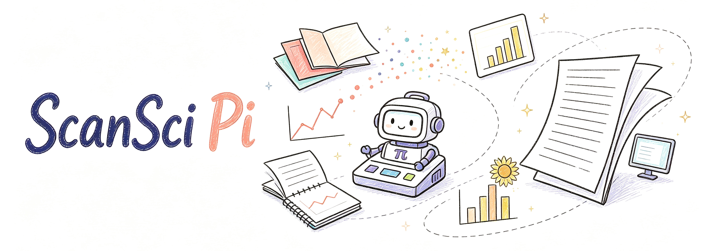
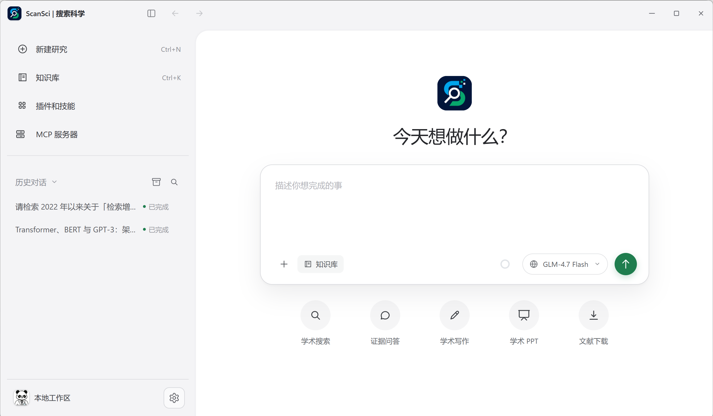

# ScanSci



## 内置互联网能力

ScanSci Pi 已内置 Agent Reach 风格的只读互联网渠道路由。直接让它读取
网页、RSS、公开 GitHub、B 站或 V2EX 内容即可，不需要另行安装
`agent-reach` CLI。遇到登录态、动态渲染或公开读取被拦截的页面，会升级到
内置的只读 `browser_access` 浏览器桥接；详见 [Agent Reach 集成说明](docs/agent-reach-integration.zh.md)。

ScanSci Pi 是一个证据优先的科研 AI 工作台：帮助你找论文、读资料、核验证据、写研究结论，并生成可交付的文档、表格和演示文稿。

## 你可以用它做什么

- 从多个学术来源发现论文，并继续获取和整理全文。
- 在本地论文库中搜索句子级证据，回答问题或撰写综述。
- 对结论绑定原文、引用和定位信息，证据不足时明确说明。
- 把研究结果整理成文档、表格、PDF 或演示文稿。

## 图片与语音

- 在输入框的“添加资料”菜单中，可以上传图片、上传语音，或直接录制语音。
- 视觉模型：先安装 [Ollama](https://ollama.com/download/windows)，再在“设置 → 本地模型 → 模型市场”下载 MiniCPM-V 4.6。
- 语音模型：同一页面下载 `Qwen3-ASR-0.6B-hf`；语音会先在本机转写，再交给当前对话模型，不上传原始音频。

如果电脑上已有旧版 `Qwen/Qwen3-ASR-0.6B`，它属于旧的 `qwen-asr` 模型格式，不能直接由当前 ScanSci 运行；请改下载 `Qwen3-ASR-0.6B-hf`。

## 界面预览



## 你可能最关心的问题

### 结论可靠吗？

ScanSci 优先使用可定位的原文证据。标题、摘要或搜索片段会明确标记为线索，不会自动冒充全文证据。

### 中途失败会怎样？

任务支持会话续接、自动纠错重试、上下文压缩和 checkpoint。已经完成的阶段会保留，不需要每次从头开始。

### 可以使用不同的模型和接口吗？

可以。运行时统一支持 Chat Completions、Responses 和 Anthropic 接口，也可以接入兼容 OpenAI API 的网关。

### 会不会随意修改文件或泄露密钥？

Agent 默认只能使用 ScanSci 白名单科研工具，shell 和任意文件修改工具默认关闭。请不要在公开 Issue 中提交 API 密钥、Access Token、私有文档全文或未脱敏日志。

## 为什么适合科研工作

- 证据可追溯：关键结论可以回到来源和原文位置。
- 过程可恢复：研究任务、工具调用和交付物状态可持续保存。
- 结果可验证：引用验证、证据门禁和交付物检查位于 Agent 会话之外。
- 工具可扩展：Pi 负责模型会话，Python Core 负责证据库、任务状态和交付物。

## 快速开始

### Windows 用户

测试版安装包从 [GitHub Releases](https://github.com/Rimagination/scansci-pi/releases) 获取。安装前请核对发布页提供的 SHA-256；当前测试版可能显示“未知发布者”或 SmartScreen 提示。

### 从源码运行

```powershell
python -m pip install -e ".[desktop]"

# 启动浏览器预览
python scripts/scansci_preview_entry.py `
  --workspace workspace.sqlite `
  --evidence-db html-papers/evidence.sqlite `
  --host 127.0.0.1 --port 8781

# 启动桌面窗口
python scripts/scansci_desktop_entry.py
```

## 开发与测试

```powershell
$env:PYTHONPATH = "src"
python -m pytest -q
```

运行时诊断：

```powershell
scansci doctor capabilities --root . --json
```

## 技术说明

- Pi sidecar：负责模型会话、工具选择、流式输出、取消、恢复和上下文压缩。
- Python ScanSci Core：负责项目、证据库、任务状态、引用验证和交付物。
- 统一传输层：在 Chat Completions、Responses 和 Anthropic 之间复用重试、SSE 和错误归一化。
- 可选 harness：PydanticAI、OpenAI Agents SDK 和 LangGraph 只在需要时安装，不影响默认启动路径。

更多运行时治理说明见 [Agent Harness P0-P2 实现说明](docs/agent-harness-p0-p2.zh.md)。

## Windows 构建

```powershell
python -m pip install -e ".[desktop,local-gpu,rerank]"
powershell -ExecutionPolicy Bypass -File scripts/build_desktop.ps1 `
  -Mode onedir -PackageProfile full -Name ScanSci
```

正式发布由 `scripts/release_gate.ps1` 驱动，详见 [发布工作流](docs/release-workflow.zh.md)。
