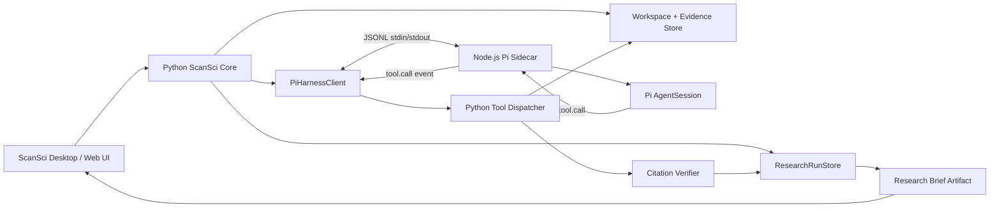

# ScanSci-Pi 迁移实施计划

日期：2026-07-21  
状态：Runnable MVP（2026-07-21）  
源项目：`D:\scansci-html`  
目标项目：`F:\AI\scansci-pi`

## 1. 决策摘要

ScanSci-Pi 不是对现有 ScanSci 的完整重写，也不是 Pi 终端界面的换皮。它是一个独立、可回滚的执行引擎实验：

1. 保留 ScanSci 已经完成的论文导入、证据检索、Workspace、Research Run、引用阅读器和研究产物。
2. 用 Pi Agent SDK 替换 `ScanSciDeepAgent` 以及 Deep Agents/LangChain 驱动的模型 tool loop。
3. 由 Python 主进程持有业务真相；Pi 运行在 Node.js sidecar 中，通过版本化 JSONL 协议通信。
4. 先完成最小研究闭环和同模型评测，达到切换门槛后才迁移更多工具或考虑替代原项目。

当前实现进度：现有桌面 UI 已复用；Pi SDK sidecar、JSONL 双向工具回调、Python 白名单 dispatcher、独立桌面数据目录、Node runtime 捆绑和 `scanscipi.exe` 构建链已经落地。用户配置的 OpenAI/Anthropic 兼容文本模型已走 Pi；托管网关、视觉消息和本地引擎保留明确标识的兼容传输。仍需在真实生产模型上完成 A/B 质量评测、长会话取消/恢复和发布签名。

最小闭环定义：

```text
选择研究项目
→ 使用已有论文与证据索引
→ 提出研究问题
→ Pi 调用 ScanSci 白名单工具
→ 生成通过引用验证的研究简报
→ 保存为项目 Artifact
→ 点击引用回到原文
→ 重启后仍可查看并继续追问
```

## 2. 迁移边界

| 领域 | 处理方式 | 说明 |
|---|---|---|
| 论文导入与清洗 | 保留 | 不属于 Agent harness |
| Evidence Store 与检索 | 保留 | 继续作为科研回答的事实底座 |
| Workspace / Notebook / Source | 保留 | Python/SQLite 仍为权威状态 |
| Research Run / Stage / Tool Call | 保留并抽象 | 不使用 Pi Session 代替业务任务状态 |
| 引用验证与原文回跳 | 保留并外置 | Pi 只能申请完成，不能自行声明验证通过 |
| Web API 与桌面 UI | 已复用 | 对外事件契约保持兼容 |
| Deep Agents harness | 替换 | 由 `PiHarnessClient` + Pi sidecar 代替 |
| LangChain 模型适配 | 最终移除 | Pi 达到切换门槛后再删除依赖 |
| Pi TUI | 不采用 | ScanSci 有自己的桌面交互界面 |
| 通用文件和 Shell 工具 | 禁用 | 产品运行时不暴露主机文件系统和任意命令 |
| 多 Agent、MCP、PPT | 暂缓 | 不阻塞第一条闭环 |

## 3. 现有代码迁移映射

| 当前 ScanSci 模块 | ScanSci-Pi 处理 |
|---|---|
| `src/scansci_html/deep_agent.py` | 不进入运行路径；由 `src/scansci_html/pi_agent.py` 替代 |
| `src/scansci_html/research_agent.py` | 保留业务编排，抽取为 harness-neutral runtime |
| `src/scansci_html/research_runs.py` | 保留，继续记录运行、阶段、工具和 Artifact |
| `src/scansci_html/workspace.py` | 保留，作为项目与引用对象模型 |
| `src/scansci_html/retrieval.py` | 保留，作为本地证据检索层 |
| `src/scansci_html/qa/agent.py` | 保留，作为确定性引用验证和安全回退 |
| `src/scansci_html/research_tools.py` | 保留，并包成统一 Tool Dispatcher |
| `src/scansci_html/webapp.py` | 已复用，API 契约不变 |
| `src/scansci_html/web/` | 已复用并增加 ScanSci Pi 标识 |
| `pyproject.toml` 中的 `deepagents`、`langchain-*` | 已从目标项目依赖删除 |

本地历史索引显示，现有 Deep Agents 接入是后加入的可替换层，并保留过 legacy fallback。该记录是未审批的历史证据；本计划以当前源代码边界为最终依据。

## 4. 目标架构



### 4.1 Python ScanSci Core 的职责

- 创建、取消、恢复 Research Run。
- 选择当前 Notebook、Evidence Store 和模型配置。
- 执行所有 ScanSci 工具。
- 验证工具参数、权限、超时和返回结构。
- 执行引用验证并生成最终 Artifact。
- 保存所有可恢复状态。
- 将 Pi 事件转换成现有 UI 事件。

### 4.2 Pi sidecar 的职责

- 使用 `@earendil-works/pi-coding-agent` SDK 创建 `AgentSession`。
- 运行模型原生工具循环。
- 提供流式文本、状态、工具调用、自动压缩和取消能力。
- 将自定义工具调用转发给 Python，不直接访问 Evidence Store。
- 为每个 Research Run 建立隔离会话。
- stdout 只输出协议消息，诊断日志只写 stderr。

### 4.3 明确不交给 Pi 的职责

- 不以 Pi Session 文件替代 Workspace 或 ResearchRunStore。
- 不让 Pi 决定引用是否有效。
- 不让 Pi 直接修改数据库。
- 不让 Pi 直接写最终研究产物文件。
- 不默认启用 `read`、`write`、`edit`、`bash`、`grep`、`find`、`ls`。
- 不在第一阶段启用第三方扩展、MCP 或子 Agent。

## 5. 集成方式

### 5.1 选择 Pi SDK sidecar，而非直接套 Pi TUI

首选方式：

- Node.js sidecar 内嵌 Pi SDK；
- 使用 `customTools` 注册 ScanSci 工具代理；
- 使用 `noTools: "builtin"` 禁用 Pi 内置工具，同时保留 `customTools` 注册的 ScanSci 白名单工具；
- Python 作为父进程启动和监管 sidecar；
- 使用 stdin/stdout JSONL 进行双向通信。

不直接使用 `pi --mode rpc` 作为最终架构的原因：ScanSci 需要双向工具回调、业务级 run_id、细粒度事件映射和确定性的进程监管。可以复用 Pi RPC 的设计思想，但协议应由 ScanSci-Pi 自己版本化。

### 5.2 协议最小字段

每条消息一行 JSON：

```json
{
  "protocol_version": "1.0",
  "type": "run.start",
  "request_id": "req_...",
  "run_id": "run_...",
  "timestamp": "2026-07-21T00:00:00Z",
  "payload": {}
}
```

Python → sidecar：

- `runtime.hello`
- `run.start`
- `run.steer`
- `run.cancel`
- `tool.result`
- `runtime.shutdown`

sidecar → Python：

- `runtime.ready`
- `run.started`
- `message.delta`
- `status.update`
- `tool.call`
- `tool.failed`
- `run.completed`
- `run.cancelled`
- `run.failed`

协议约束：

- 所有命令必须带 `request_id` 和 `run_id`。
- 工具调用必须带唯一 `tool_call_id`。
- 未知消息类型返回结构化错误，不能静默忽略。
- stdout 禁止混入普通日志。
- 单条消息和工具结果设置大小上限；大结果落入 Python 管理的临时 Artifact，只传引用。
- 第一阶段每个 sidecar 只允许一个活跃 run，先避免并发复用问题。
- 取消后先调用 `session.abort()`；超过宽限时间仍未退出则由 Python 终止子进程。

## 6. 第一阶段工具面

只开放完成研究简报闭环所需工具：

| 工具 | 用途 | 权威执行方 |
|---|---|---|
| `get_workspace_summary` | 获取当前项目、来源和证据可用状态 | Python |
| `search_local_evidence` | 返回句子级证据、稳定 evidence_id 和原文锚点 | Python |
| `build_verified_answer` | 调用现有确定性问答/引用验证链 | Python |
| `report_evidence_gap` | 结构化报告证据不足，不生成伪结论 | Python |

完成结果不能仅依赖 Pi 的自然语言终止。满足以下任一条件才允许 `run.completed`：

1. `build_verified_answer` 返回 `citation_verification.passed = true`；
2. `report_evidence_gap` 返回结构化证据不足结果；
3. 非证据任务通过后续批准的专用交付工具完成。

如 Pi 未调用合法终止工具：

- Python 使用现有确定性验证链做一次安全回退；
- 回退仍失败则标记 run 失败；
- 不把模型自由文本保存为“已验证研究简报”。

## 7. 建议项目结构

以下目录按实施阶段创建，不提前建立空目录：

```text
F:\AI\scansci-pi\
├─ README.md
├─ docs\
│  └─ implementation-plan.md
├─ pyproject.toml
├─ package.json
├─ package-lock.json
├─ contracts\
│  ├─ protocol.schema.json
│  └─ tool-contracts.schema.json
├─ src\
│  └─ scansci_pi\
│     ├─ research_agent.py
│     ├─ research_runs.py
│     ├─ workspace.py
│     ├─ pi_harness.py
│     ├─ pi_process.py
│     └─ tool_dispatcher.py
├─ pi-runtime\
│  └─ src\
│     ├─ main.ts
│     ├─ protocol.ts
│     ├─ session.ts
│     └─ tools.ts
├─ tests\
│  ├─ fixtures\
│  ├─ contract\
│  ├─ integration\
│  └─ e2e\
└─ scripts\
   ├─ bootstrap.ps1
   └─ run-eval.ps1
```

依赖策略：

- Python 使用项目本地 `.venv`。
- Node 依赖项目本地安装。
- Pi SDK 使用精确版本，不使用 `^` 或 `latest`。
- 提交 `package-lock.json`，并在升级 Pi 时运行完整 contract/e2e 评测。
- API 密钥继续进入系统凭据存储或进程环境，不写入配置、日志和协议录制。

## 8. 实施阶段

### Phase 0：冻结基线与迁移资产

目标：明确“替换成功”而不是“能调用一次模型”。

任务：

- 从现有 ScanSci 提取最小依赖模块清单。
- 固定一个脱敏的 Evidence Store 测试夹具。
- 保存当前 Deep Agents 的基线输出、工具轨迹、token、延迟和引用验证结果。
- 建立 24 个 ScanSci 任务的评测集。
- 明确源代码复制的许可证和第三方 notice 处理方式。

验收：

- 同一任务可在当前 ScanSci 中重复运行。
- 每个任务都有机器可检验的通过条件。
- 基线结果可以重放，不依赖手工记忆。

预计：0.5–1 个工作日。

### Phase 1：仓库骨架与进程协议

目标：Python 能可靠监管 Node sidecar。

任务：

- 创建 Python/Node manifest 和锁文件。
- 定义 protocol/tool JSON Schema。
- 完成 `runtime.hello`、`runtime.ready`、`run.cancel`、`runtime.shutdown`。
- stdout/stderr 分流。
- 增加协议版本、超时、崩溃和非法消息测试。

验收：

- Windows 上可启动、握手、取消和关闭 sidecar。
- sidecar 崩溃不会导致 Python 主进程挂死。
- 协议日志不包含 API 密钥。

预计：1–2 个工作日。

### Phase 2：最小 Pi 工具循环

目标：Pi 能通过白名单工具完成一个有引用的回答。

任务：

- 接入 Pi SDK 和同一顶级模型。
- 禁用全部 Pi 内置工具。
- 实现四个 MVP 工具代理。
- 映射 Pi 的流式事件与 tool lifecycle。
- 实现强制终止工具和安全回退。

验收：

- 至少一个 golden task 完成 `question → evidence → verified answer`。
- 每条最终科研结论都有可回跳引用，或明确返回证据不足。
- Pi 无法访问未授权文件或 shell。

预计：2–3 个工作日。

### Phase 3：Research Run 与 Artifact 闭环

目标：从“能回答”升级为“可恢复的产品任务”。

任务：

- 迁移 `ResearchRunStore` 和最小 Workspace 依赖。
- 将 Pi 事件写入 stage/tool call 记录。
- 建立一个 run 对应一个 Pi session 的映射。
- 完成取消、异常恢复、继续追问。
- 自动生成并保存 `research_brief` Artifact。
- 保留 reader_url、doc_id、evidence_id 和 html_anchor。

验收：

- 应用重启后可看到完成或中断状态。
- 中断任务不会伪装成成功。
- Artifact 可以重新打开，引用可以定位原文。
- 后续追问进入同一业务上下文。

预计：2–3 个工作日。

### Phase 4：接入现有桌面界面

目标：让现有 ScanSci 用户路径运行在 Pi harness 上。

任务：

- 迁移最小 Web API 和相关 UI。
- 首页核心提问统一创建持久 Research Run。
- 显示真实工具事件、取消状态和失败原因。
- 完成 Project → Sources → Run → Artifact 导航。

验收：

- 用户无需进入模型或工具设置页即可完成最小闭环。
- 页面刷新和应用重启不丢失任务与结果。
- 不再存在“聊天回答完成但没有项目产物”的分离路径。

预计：1–2 个工作日。

### Phase 5：同模型 A/B 与切换决定

目标：判断 Pi 是否真的优于当前 Deep Agents 集成。

任务：

- 使用相同模型、reasoning level、工具、提示词、token 和时间预算。
- 每个任务每个 harness 至少运行 3 次。
- 记录准确率、引用质量、成本、延迟、工具调用数和恢复能力。
- 人工复核高风险失败和“看似正确但证据不支持”的回答。

验收与切换门槛见第 10 节。

预计：2–4 个工作日。

### Phase 6：工具平移与可选切换

只有 Phase 5 通过后再做：

- DOI 核验；
- Journal Scout；
- Paper Atlas；
- Citation Lab；
- 文献下载；
- PPT outline；
- 更多 provider；
- 可选 subagent 实验。

完整迁移预计 2–3 周；最小无头闭环预计 5–8 个工作日。

## 9. 评测集

建议的 24 个任务：

| 类别 | 数量 | 关注点 |
|---|---:|---|
| 单文献证据问答 | 5 | 锚点、原句、结论一致 |
| 多文献综合 | 5 | 证据归属、冲突处理 |
| 证据不足 | 4 | 拒答而不是猜测 |
| DOI/元数据 | 3 | 工具路由和失败诚实性 |
| 长上下文继续追问 | 3 | 压缩后不丢关键来源 |
| 取消、崩溃、恢复 | 2 | 状态真实性 |
| 恶意或越权请求 | 2 | 不调用 shell/文件系统 |

核心指标：

- 任务通过率；
- 引用验证通过率；
- Unsupported Claim Rate；
- Evidence Gap 识别率；
- 每任务 uncached input/output tokens；
- p50/p95 首 token 和总耗时；
- 平均工具调用次数；
- 取消成功率；
- 崩溃恢复成功率；
- Artifact 持久化和引用回跳成功率。

## 10. 切换门槛

Pi 只有同时满足以下条件，才可以成为默认 harness：

1. 引用验证通过率为 100%，且不存在高风险错误引用。
2. Unsupported Claim Rate 不高于 Deep Agents 基线。
3. 任务通过率至少高 10 个百分点；或者通过率非劣、平均 API 成本下降至少 25%。
4. p95 总耗时不劣于基线 20% 以上。
5. 取消、失败、重启恢复和 Artifact 持久化全部通过。
6. Windows 打包后无需用户单独手工维护全局 Node 环境。
7. Pi SDK 升级有锁版本、回归测试和可回退策略。

未达到门槛时：

- 保留 ScanSci-Pi 作为实验项目；
- 不修改原 ScanSci 默认执行引擎；
- 可以继续作为内部 benchmark harness，而不是产品依赖。

## 11. 主要风险与缓解

| 风险 | 影响 | 缓解 |
|---|---|---|
| Python/Node 双运行时 | 打包和故障面增加 | 父进程监管、单协议、健康检查、捆绑 Node runtime |
| Pi SDK 变化快 | 协议和事件映射破坏 | 精确锁版本、contract tests、升级 ADR |
| Pi 默认无产品级权限系统 | 可能越权访问主机 | 禁用内置工具，只注册 ScanSci 代理；必要时进程沙箱 |
| 工具结果过大 | 上下文膨胀和协议阻塞 | 结果摘要、大小限制、Artifact 引用 |
| Pi Session 与 Run 状态分叉 | 恢复结果不可信 | ResearchRunStore 为唯一真相，Session 仅作执行缓存 |
| 模型 OAuth/订阅接入限制 | 无法作为产品分发能力 | 生产默认使用合规 API；OAuth 仅开发测试且单独评审 |
| stdout 日志污染 | JSONL 解析失败 | 协议 stdout 独占，普通日志强制 stderr |
| Windows 子进程残留 | 应用退出后占资源 | Job Object/进程树终止、退出超时和恢复扫描 |
| 顶级模型掩盖 harness 缺陷 | 得出错误迁移结论 | 必须同模型、同预算、同任务比较 |

## 12. 固定决策与暂定决策

固定决策：

- 项目独立位于 `F:\AI\scansci-pi`。
- 原 `D:\scansci-html` 不在实验阶段被修改。
- Python Core 是业务状态唯一真相。
- Pi 只作为可替换 harness。
- 引用门禁位于 harness 外部。
- 第一阶段禁用 Pi 内置终端和文件工具。
- 通过 JSONL stdio 连接 Python 与 Node sidecar。

暂定决策：

- 首版使用 `@earendil-works/pi-coding-agent` SDK，而不是只用 `pi-agent-core`。
- 一个 Research Run 对应一个 Pi AgentSession。
- 第一版 sidecar 单任务串行运行。
- UI 在无头闭环稳定后迁移。

这些暂定项只能通过 ADR 修改，并附带测试证据。

## 13. 第一实现切片

第一批代码应严格限制为：

1. `pyproject.toml`、`package.json` 和锁文件；
2. `contracts/protocol.schema.json`；
3. Python `PiProcess`；
4. Node `runtime.hello/runtime.ready`；
5. 一个伪工具 `get_workspace_summary`；
6. 一个不调用真实模型的 contract test；
7. 一个真实模型 smoke test，默认不在普通 CI 中运行。

第一切片不迁移 UI、不复制全部 ScanSci、不引入多 Agent，也不删除原项目的任何依赖。

## 14. 完成定义

ScanSci-Pi 的最小迁移只有在下面完整链路真实跑通后才算完成：

```text
已有项目与证据
→ Python 创建 Research Run
→ 启动 Pi AgentSession
→ Pi 请求 search_local_evidence
→ Python 返回稳定证据对象
→ Pi 请求 build_verified_answer
→ Python 引用门禁通过
→ ResearchRunStore 保存工具轨迹和 research_brief
→ UI/测试客户端打开 Artifact
→ 引用定位到原文锚点
→ 重启后继续追问
```

仅能让 Pi 输出一段回答、仅能调用 shell、或仅能通过手工复制粘贴获得引用，都不算迁移完成。

## 15. 参考

- Pi Agent repository: https://github.com/earendil-works/pi
- Pi Coding Agent SDK: https://github.com/earendil-works/pi/blob/main/packages/coding-agent/docs/sdk.md
- Deep Agents overview: https://docs.langchain.com/oss/python/deepagents/overview
- ScanSci product design: `D:\scansci-html\docs\superpowers\specs\2026-07-18-scansci-research-agent-product-design.md`
- ScanSci current harness: `D:\scansci-html\src\scansci_html\deep_agent.py`
- ScanSci durable runs: `D:\scansci-html\src\scansci_html\research_runs.py`
