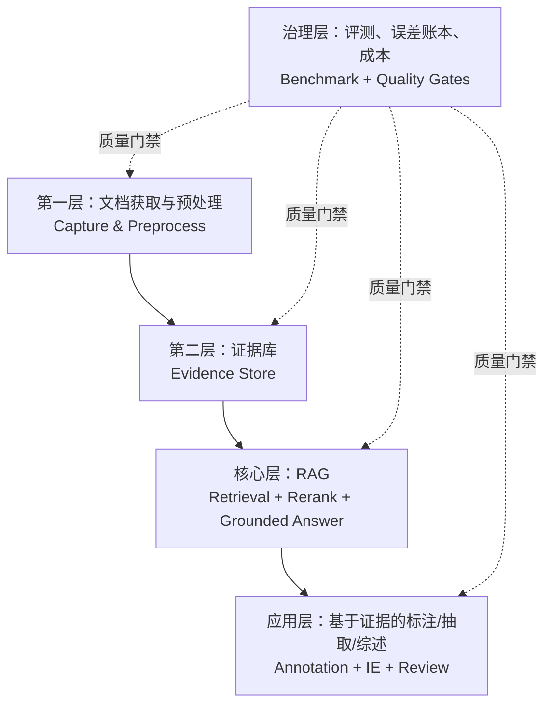

# ScanSci 项目架构治理

本文定义 ScanSci 的长期分层、模块归属和扩展规则。目标不是把项目变复杂，而是避免所有能力都堆进一个“RAG 脚本”：文档获取和预处理是第一层，RAG 是核心层，基于证据的标注、信息抽取和综述是 RAG 之上的应用层。

## 核心原则

ScanSci 是 evidence-first 的文献智能系统。每一层只对下一层交付清晰产物，不跨层偷做别人的工作。

- 第一层负责把论文拿到并清洗成可审计、可索引的 clean HTML。
- 证据层负责把 clean HTML 变成稳定的句子、表格行、caption 和引用锚点。
- RAG 核心层负责召回、重排、证据选择、引用校验和 grounded answer。
- 标注/抽取/综述层负责把证据转成实体、关系、观点矩阵、综述草稿和人工审阅界面。
- 评测治理层负责公开数据集、消融、误差账本、速度和成本，不让主观感觉替代数据。



## 论文资产保存策略

ScanSci 的论文长期母本是 `clean HTML`，不是 PDF、Markdown 或出版社原始 XML。原因是 clean HTML 同时服务人类阅读、结构化解析、证据回跳和 RAG 预处理。

推荐资产分级：

| 资产 | 默认策略 | 角色 |
|---|---|---|
| `paper.html` | 长期保存 | 论文母本，保留统一的正文结构和来源元数据 |
| `evidence.sqlite` | 可重建，但实际项目中通常保留 | 统一 evidence 层，供 RAG、实体抽取、标注和综述共同使用 |
| `paper.evidence.html` | 按需生成 | 干净的证据锚点视图，用于把 `evidence_id/html_anchor` 跳回原文句子；默认不显示全局高亮或角标 |
| `annotation_layers.sqlite` | 长期保存 | 软标注图层库；不同问题、综述角度和人工审阅结果作为 layer 叠加到同一证据锚点上 |
| `workspace.sqlite` | 长期保存 | Notebook/Source/Note/Layer/CitationRecord/CitationAudit 的对象索引和关系图 |
| `annotation-viewer.html` | 可重建 | 通用软标注阅读器；读取 layer 快照，在同一篇原文视图上切换高亮和 source card |
| `source.xml.gz` | 可选保存 | 出版社 XML 原始输入追溯和重新转换材料，不作为下游统一接口 |
| raw snapshot | 调试时保存 | 获取失败、结构异常、权限判断等问题的现场证据 |
| PDF | 不默认保存 | 兜底原件或视觉核查，不作为 RAG 主格式 |
| Markdown | 不默认保存 | 人类笔记、摘要、综述草稿，不作为论文母本 |
| 图片资产 | 按需保存 | 图像审计或离线阅读需要时保存，默认避免全量占用磁盘 |

如果出版社提供 XML，第一层可以优先用 XML 作为高质量输入，但应转换成统一 `paper.html` 后再进入 evidence 层。RAG、实体抽取、标注和综述不应直接依赖 Elsevier XML、JATS、Wiley XML 等出版社 schema；它们消费的是统一 evidence 层。

## 第一层：文档获取与预处理

这一层回答：“我如何合法、稳定地拿到论文正文，并把它变成统一结构？”

输入可以是 DOI、URL、检索结果、PMC/JATS、出版社 XML、出版社 HTML、浏览器可见页面、CNKI 导出，或来自 `paper-fetch` 经验的 provider 结果。输出必须收敛到同一个 clean HTML 契约，而不是每个来源各自生成一种下游格式。

主要职责：

- 官方来源解析：DOI、landing page、full-text XML/JATS、publisher route。
- provider 获取：复用 `paper-fetch` 的来源经验，但作为 ScanSci 的原生 source fetcher。
- 浏览器获取：只有在需要可见页面或登录态访问时才使用。
- 预处理：去噪、结构归一、图片和表格资产处理、元数据保留。
- 结构门禁：判断是否是真正文献正文，而不是摘要页、登录页、错误页或目录页。

当前模块归属：

| 模块 | 归属说明 |
|---|---|
| `resolver.py` | DOI/URL 解析和入口规范化 |
| `official_sources.py` | 官方来源链路编排 |
| `paper_fetch_source.py` | `paper-fetch` provider 经验的原生接入 |
| `fetchers.py` | 网络获取和基础下载 |
| `browser.py`, `browser_runtime.py`, `browser_identity.py`, `browser_config.py` | 浏览器侧获取和身份配置 |
| `publisher_recipes.py` | 出版社/来源配方 |
| `cleaner.py` | HTML 清洗 |
| `article_structure.py` | 文献正文结构判断 |
| `assets.py` | 图像等资产处理 |
| `snapshots.py` | 调试快照和失败现场 |
| `cnki_reader.py` | CNKI HTML/导出结构读取 |
| `credentials.py` | 本地凭据读取边界，禁止写入文档或日志 |

治理规则：

- 本层可以联网、访问浏览器、解析 provider 响应，但不能做 RAG 检索、回答生成或向量库决策。
- 本层默认产物是 clean HTML，不默认保存 PDF、Markdown、cookie、token 或登录态。
- 所有来源配方最后必须对齐 `docs/clean-html-contract.zh.md`。
- 新增来源时，先写 source fetcher 和 clean HTML 测试，再考虑上层功能。

## 第二层：证据库

这一层回答：“哪些最小证据单元可以被检索、引用、审计和复用？”

输入是第一层的 clean HTML。输出是证据单元，而不是答案。证据单元应包含稳定 `doc_id`、段落/句子/table/caption 类型、section 信息、文本、来源锚点和必要元数据。

主要职责：

- 从 clean HTML 抽取 evidence spans。
- 建立可复用的 SQLite evidence store。
- 做 coverage/doctor 检查，发现空正文、结构坏块、缺少锚点等问题。
- 维护证据粒度：句子、段落、表格行、图表 caption、章节标题。

当前模块归属：

| 模块 | 归属说明 |
|---|---|
| `evidence_spans.py` | 从 HTML 抽取证据块 |
| `evidence_store.py` | SQLite 证据库 |
| `evidence.py` | 证据对象和公共操作 |
| `evidence_doctor.py` | 证据质量诊断 |
| `coverage.py` | 覆盖率和可用性检查 |
| `citations.py` | 引用和来源锚点辅助 |

治理规则：

- 证据层不负责“找哪篇论文最相关”，只负责把每篇论文变成可检索证据。
- 证据层可以提供索引字段，但不应绑定某个 reranker、LLM 或综述模板。
- 上层输出的每个关键结论都应该能回指到这里的 evidence id 或 quote id。

## 核心层：RAG

这一层回答：“给定问题，如何从证据库中找到足够证据，并生成可核验答案？”

RAG 是 ScanSci 的核心层。它不应该重新下载论文，也不应该直接依赖原始网页结构。它消费证据库，输出排序证据、引用、检索 trace、答案草稿和校验结果。

主要职责：

- paper-level recall：先在大文献库里缩小候选论文集合。
- query rewrite / multi-query：处理问题表达和学科术语不一致。
- hybrid retrieval：结合 FTS/BM25、dense embedding 和元数据过滤。
- rerank：用 MiniLM、BGE/Qwen 等 reranker 重新排序候选证据。
- agentic retrieval：在复杂问题上有限制地追加检索，而不是无限循环。
- citation verification：检查生成内容是否引用了真实证据。
- grounded answer：答案必须带证据、来源和可审计 trace。

当前模块归属：

| 模块 | 归属说明 |
|---|---|
| `retrieval.py` | 检索策略和候选证据召回 |
| `embeddings.py` | embedding 模型和向量表示 |
| `rerankers.py` | reranker 组件 |
| `llm.py` | LLM 调用封装 |
| `qa/query_planner.py` | 查询规划和改写 |
| `qa/agent.py` | 有界多步检索 |
| `qa/evidence_table.py` | 证据表构造 |
| `qa/quote_extractor.py` | 精确引用抽取 |
| `qa/synthesizer.py` | 基于证据的回答综合 |
| `qa/verifier.py` | 引用和答案校验 |
| `qa/schemas.py` | RAG 输入输出结构 |

治理规则：

- RAG 核心层只能消费 evidence store 或等价证据对象，不能把网页下载逻辑塞进检索路径。
- RAG 输出必须保存 trace：候选来源、召回路径、reranker、query variants、引用 id。
- 新增模型时必须说明它替代的是 embedding、reranker、LLM synthesizer、verifier 还是 planner。
- 重要模型替换要进入 benchmark，而不是只凭一次聊天效果判断。

## 应用层：基于证据的标注、抽取和综述

这一层回答：“如何把证据转成研究者真正需要的结构化知识？”

这里包括实体抽取、关系抽取、观点矩阵、论文综述、人工标注、审稿式检查、证据表导出等。它可以调用 RAG 核心层拿证据，也可以直接消费 evidence store 做批量抽取，但不能绕过证据链。

NotebookLM-like 产品的优点应主要吸收到本层：notebook/source/note/layer 的产品组织、点击引用后的原文同步定位、source card、软标注层、证据矩阵和报告/术语表/时间线等产物生成。具体调研和取舍见 [`docs/notebooklm-like-lessons.zh.md`](notebooklm-like-lessons.zh.md)。这些优点不改变底层边界：ScanSci 仍以 clean HTML/XML 和 evidence store 为可信证据层，不退化成通用 PDF 聊天工具。

从 Cite 项目吸收的新增边界是：citation fidelity 也属于应用层正式对象。ScanSci 用 `CitationRecord` 保存 claim、引用编号、quote snapshot 和 `source_location`，用 `CitationAudit` 保存机器审计 verdict；人工确认仍通过 `review_state` / review matrix 回写，不与机器 verdict 混用。

主要职责：

- 实体和术语候选：从证据中抽取学科实体、方法、数据集、指标、物种、材料等。
- 信息抽取：实体类型、关系、实验设置、结果和限制。
- 证据标注：把每个标签绑定到句子、表格行或 caption。
- Grounded annotation：把用户已有的笔记、claim 或综述草稿逐句做多查询召回、候选去重、claim-evidence 支持验证，再生成类似 NotebookLM 的引用标注、source preview 和人工审阅界面。
- 综述辅助：生成有引用的对比表、主题矩阵和段落草稿。
- 人工审阅：让用户按证据确认、修改或拒绝标签。

当前模块归属：

| 模块 | 归属说明 |
|---|---|
| `entity_candidates.py` | 实体候选抽取 |
| `ie_model_candidates.py` | IE 模型候选和方法比较 |
| `ie_type_classifier.py` | 实体/信息类型分类 |
| `annotation_layers.py` | 软标注 layer 的 SQLite 存储和 viewer 数据快照 |
| `grounded_annotation.py` | 草稿/claim 到 evidence 的多查询召回、支持验证和引用选择 |
| `review.py` | 人工审阅和矩阵工作流 |
| `workspace.py` | Notebook/Source/Note/Layer/CitationRecord/CitationAudit 的本地对象关系 |
| `literature_workflow.py` | 文献综述工作流编排 |
| `render/report.py` | 报告渲染 |
| `render/grounded_annotation.py` | NotebookLM-style 标注报告渲染 |
| `render/annotation_viewer.py` | 可切换软标注图层的通用阅读器渲染 |
| `render/gold_template.py` | 人工 gold/template 输出 |
| `render/gold_validation.py` | 标注/答案校验展示 |

治理规则：

- 标注结果必须包含证据 id、原文 quote、source anchor、支持状态和待审状态。
- 面向反复提问的标注应优先保存为软标注 layer，而不是为每个问题复制一份原文 HTML。
- `paper.evidence.html` 只承担定位和审计，不应默认把所有候选句子高亮；只有被当前答案、问题或审阅 layer 命中的证据才应该高亮。
- 面向用户阅读的 HTML/report/viewer 默认使用中文界面、`zh-CN` 语言标记和中文友好的字体；内部 JSON 字段和枚举可以保留英文，保证机器协议稳定。
- 面向用户阅读的 evidence cards、citation 和 overlay 默认只展示 `supported` 与 `partial_support`；`weak_candidate` 只能作为“证据不足”的内部诊断状态保留，不能作为可引用证据展示。
- 综述草稿中的事实性句子必须能追溯到证据表。
- 应用层可以有领域 schema，但 schema 不应该污染底层 clean HTML 或证据库契约。
- “看起来合理”的 LLM 抽取不能直接入库，必须保留待审状态或置信度。

## 治理层：评测、误差账本和成本

这一层回答：“我们如何知道一个技术组合真的更好、更快、更适合个人电脑？”

评测治理层横跨所有层，但不替代业务逻辑。它负责公开数据集、benchmark protocol、leaderboard、误差案例、速度成本、消融和回归测试。

主要职责：

- 公开数据集导入：QASPER、SciFact、HotpotQA、SciERC、ScienceIE 等。
- 检索、重排、IE 和 citation verification 的分项评测。
- 速度和成本记录：每题耗时、每篇耗时、API 调用次数、本地 CPU/GPU 压力。
- mistake ledger：记录失败原因、修复、回归保护。
- 结果可比性：区分 smoke sample、dev/calibration、blind/public benchmark。

当前模块和文档归属：

| 模块/文档 | 归属说明 |
|---|---|
| `bench.py`, `bench_protocol.py` | benchmark 主流程和协议 |
| `bench_external.py`, `bench_import.py`, `bench_fetch.py` | 外部数据集导入和获取 |
| `bench_leaderboard.py` | 可比实验排名 |
| `bench_mistakes.py` | 误差案例沉淀 |
| `ie_bench.py` | 信息抽取 benchmark |
| `docs/benchmark-suite.zh.md` | benchmark 方法说明 |
| `docs/evidence-retrieval-leaderboard.zh.md` | 检索结果榜单 |
| `docs/mistake-ledger.zh.md` | 失败和经验账本 |

治理规则：

- 公开 benchmark、用户私有文献库 gold set、临时 smoke test 必须分开报告。
- benchmark 结果必须记录模型、参数、样本范围、数据版本和运行时间。
- 提升分数的改动必须能解释是召回、重排、LLM、证据粒度还是评测口径变化。

## 编排层和 CLI

### Pi 编排层与 Host 权威层

v0.4.0 把编排拆成两类职责，二者不得混写：

- **Pi 编排层**消费当前上下文与授权目录，由模型决定研究路线、工具发现与只读并行、Skill 指令加载、科研子代理委派、延迟 MCP 激活、多模态消息以及压缩/分叉等会话动作。
- **Host 权威层**拥有 Workspace、Evidence Store、ResearchRunStore、任务契约、租约、审批 token、effect policy、证据/引用验证、Artifact 提交与发布审计；任何 Pi 输出都只是请求或候选，不是授权事实。

两层通过 `protocol v7` 和当前 request/run/generation 绑定；搜索、激活、调用、结果提交都重新授权。空租约、未知工具、未知 MCP effect、过期请求、越界 URI 或 schema 不匹配一律 fail-closed。Skill 只增加指令，不增加证据或权限；子代理最多 3 个且只有父租约的只读子集；MCP annotations 只能抬高风险，不能降低 Host policy。

Host 的确定性产品事实、effect 前拒绝、引用后处理和 evidence gate 继续保留。它们若绕过模型调用，不算模型介导轮次，也不计入 Pi routing；任何 direct fallback 或 capability degradation 都必须在报告中显式出现。

少数模块可以跨层编排，但它们只负责把层串起来，不应该把所有细节写在自己里面。

| 模块 | 角色 |
|---|---|
| `cli.py` | 命令入口和参数路由 |
| `evidence_agent.py` | 确定性的 evidence/workbench/workspace 状态编排，输出 status/next JSON |
| `evidence_agent_runtime.py` | 本地小模型 harness：observe/decide/act loop、human gate、run manifest |
| `service.py` | 获取/预处理服务编排 |
| `broker.py` | 工作流调度边界 |
| `discovery.py` | 文献发现入口 |
| `opencli_bridge.py` | 外部命令桥接 |

当前 CLI 已提供兼容式分层别名。老的扁平命令继续可用，新的分层命令会在入口处映射到现有实现：

```text
scansci capture fetch      # 第一层：获取和预处理，映射到 fetch
scansci evidence index     # 第二层：证据库，映射到 index-v2
scansci rag search         # 核心层：检索，映射到 search-v2
scansci rag ask            # 核心层：证据问答，映射到 ask
scansci annotate entities  # 应用层：实体/标签，映射到 entity-candidates
scansci annotate review    # 应用层：人工审阅，映射到 review-matrix
scansci annotate ground    # 应用层：草稿逐句证据标注，映射到 grounded-annotate
scansci annotate viewer    # 应用层：软标注图层阅读器，映射到 annotation-viewer
scansci bench run          # 治理层：评测，映射到 bench
scansci agent status       # 编排层：查看 evidence/workbench/workspace 状态，映射到 agent-status
scansci agent next         # 编排层：给出下一步可执行动作，映射到 agent-next
scansci agent plan         # 编排层：给出 evidence/workbench/benchmark 阶段计划，映射到 agent-plan
scansci agent run          # 编排层：运行 bounded local-model harness，映射到 agent-run
```

新增命令应优先进入相应分层入口；只有为了兼容旧脚本时，才继续增加新的扁平命令。

## 新功能放置规则

| 你要新增的能力 | 应该放在 | 不应该放在 |
|---|---|---|
| 新出版社、新 provider、新 DOI 获取路径 | 第一层 | RAG 或标注模块 |
| HTML/XML/JATS 转 clean HTML | 第一层 | evidence store |
| 证据块 schema、句子切分、表格行抽取 | 第二层 | LLM synthesizer |
| embedding、BM25/FTS、query rewrite、reranker | RAG 核心层 | capture/fetcher |
| citation verification、quote extraction | RAG 核心层 | cleaner |
| 实体抽取、关系抽取、综述矩阵 | 应用层 | fetcher 或基础证据层 |
| NotebookLM-style 草稿标注、source card、人工审阅界面 | 应用层 | evidence store schema 或 fetcher |
| 软标注 layer、overlay viewer、同一原文上的高亮切换 | 应用层 | 复制 paper.html 或污染 clean HTML |
| QASPER/SciFact/SciERC/ScienceIE 数据导入 | 治理层 | 用户工作流默认路径 |
| 速度、成本、失败案例记录 | 治理层 | 临时脚本散落保存 |

## 反模式

- RAG 检索时临时联网下载论文。
- fetcher 在保存 clean HTML 的同时写向量库或生成答案。
- 标注结果只有 LLM 输出，没有 evidence id、quote 或 source anchor。
- benchmark 把公开测试集、临时样本和用户私有 gold set 混在一个分数里。
- 把 Markdown 当作唯一检索来源，丢掉 HTML 的章节、表格、caption 和锚点。
- 把 API key、cookie、机构登录态写进文档、日志、fixture 或快照。

## 近期治理路线

1. 先稳定第一层到第二层的契约：所有来源都收敛到 clean HTML，再进入 evidence store。
2. RAG 核心层继续以 hybrid retrieval + rerank + citation verification 为主线，所有模型替换都按组件角色评测。
3. 应用层优先做 evidence-bound entity extraction、grounded annotation 和 review matrix，不做无证据的自由生成。
4. benchmark 继续维护公开数据集复现、轻量 smoke test 和本地速度测试三条线，报告时明确区分。
5. 等模块边界稳定后，再考虑目录重组；在此之前，先用文档和测试约束架构，避免大规模搬家带来噪音。
