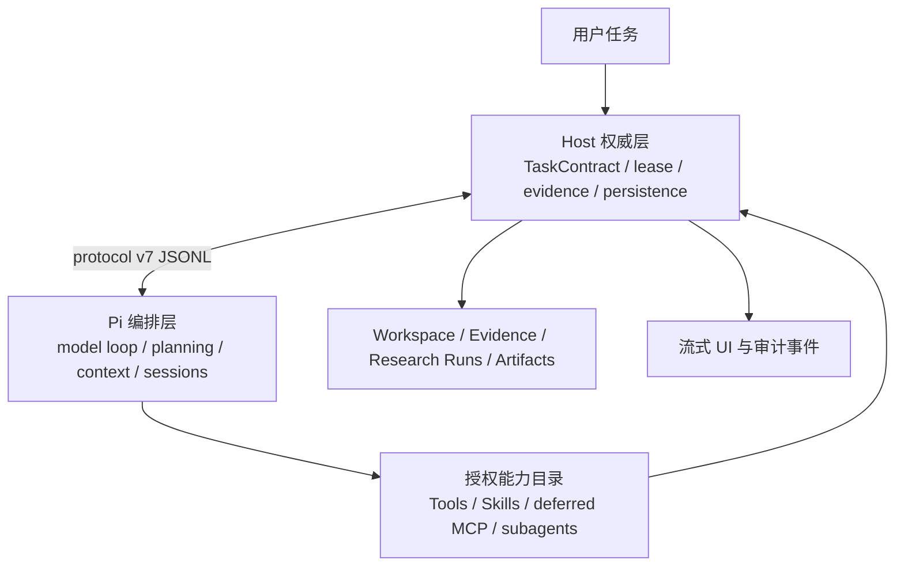

# ScanSci 科研 Agent 架构（v0.4.0）

本文是 ScanSci 科研 Agent 的当前权威契约。目标不是把 ScanSci 变成无边界的通用编码 Agent，而是在可追溯、可复核、可恢复的科研业务边界内充分使用 Pi Agent SDK。

## P0 与历史状态

唯一当前 P0 是 `config/release-scope.json` 中的 v0.4.0。原 v0.3.1 P0 已完整冻结到 `release_history`，状态为 `superseded` / `frozen_unverified`：仓库没有可复核的 v0.3.1 tag 或通过的 release report，因此不得把冻结历史写成 released。

“100% Pi 能力”只表示本仓库声明的 13 项能力在权限边界内实现，并由 Task8 的 10 个报告轴验收；它不等于无限资源、无限上下文、无限并发、任意模型质量或整个 Pi/第三方生态的所有 extension。

13 项声明能力是：

1. protocol/feature 协商与 fail-closed 租约；
2. 所有模型介导轮次 Pi-first 自主规划；
3. 动态工具搜索、激活、撤销与逐次授权；
4. 只读并行、effect 顺序屏障、hooks 与取消隔离；
5. 模型感知长上下文、压缩和恢复；
6. 渐进式 Skill 发现与有界资源加载；
7. 最多三个只读科研子代理及结构化交接；
8. 队列、abort-compaction、close/load、clone/fork 等会话控制；
9. 延迟 MCP 目录、连接、真实 schema 与 effect 审计；
10. 受限多模态 Pi 消息与显式不支持降级；
11. 审批、路径、秘密、未知 effect 与 late-result 安全隔离；
12. 重试、只读缓存、幂等与断连/超时恢复；
13. run/effect/subagent/compaction 的可观测性和哈希绑定发布证据。

10 个报告轴是 `routing`、`dynamic_tools`、`parallelism`、`long_context`、`skills`、`subagents`、`mcp`、`multimodal`、`safety`、`observability`。能力实现与发布通过是两回事：缺少 real provider 凭据时可以完成确定性实现，但 provider-dependent 轴和正式发布仍为 `not_run`/blocked。

## 权责边界

### Host 权威层

Python Host 负责：

- 编译 `scansci.task-contract.v2` 和 capability lease，逐次校验 request/run/generation、风险、预算、调用次数和审批 token；
- 执行所有 ScanSci 工具、Workspace/Evidence/ResearchRun/Artifact 读写和稳定 `scansci://` URI 校验；
- 执行证据充分性、引用验证、科学改写/时间交付等后处理；这些护栏保留，但不能冒充 Pi 的模型能力；
- 把模型、工具、effect、子代理、MCP、压缩和降级事件写入有界、脱敏、可恢复的记录；
- 在危险或未知状态 fail-closed。空租约不暴露可执行工具，只有显式 `approve` 能产生 request-scoped approval token。

### Pi 编排层

Node sidecar 中的 Pi AgentSession 负责：

- 在 Host 授权目录内读取完整的模型感知上下文，自主规划路线；
- 使用 `search_tools` / `search_skills` / `load_skill` 逐步发现能力；
- 批量并行 thread-safe 只读工具，按顺序执行 effectful 工具；
- 使用 hooks、steer/follow-up、compaction、queue、abort、clone/fork 和 session resume；
- 委派安全科研子代理、使用延迟 MCP 和经验证的图像内容；
- 把工具请求发给 Host，而不是直接触碰业务数据库或任意主机能力。

Pi 不决定租约、审批、证据真伪、引用是否通过、Artifact 是否提交，也不能修改 Host 的完成判定。

### 不对任何模型开放的能力

- 不开放任意 shell、任意文件系统读写、Pi 内置 `bash/read/write/edit/find/grep/ls` 或任意第三方 extension；
- 不允许 Skill、MCP annotations、工具描述、模型文本或子代理结果改变 capability lease；
- 不把 Session JSONL 当作 Workspace/ResearchRunStore 的业务真相；
- 不把未经验证的模型自由文本保存为“已验证研究简报”。

## protocol v7 与 schema 迁移

当前 wire 只写 `protocol v7`，启动必须协商严格 required features；Node 和 Python 都校验消息大小、类型、schema、当前 request/run/generation、工具调用 ID 和结果归属。过期、未知、跨请求或 late result 不得进入当前历史或持久化结果。

迁移规则：

- TaskContract 只写 v2；旧 v1/整数版本只在一个兼容窗口内读取，再编译为当前租约，不能沿用旧权限语义；
- `research_runs schema v4` 采用 additive migration，保存已存在 run、stage、tool、artifact 和 session 引用；
- capability lease、model-runtime descriptor、subagent-result 与 mcp-effect 各自使用 v1 schema；未知字段不产生权限；
- 旧 eager/direct MCP 配置保留为显式兼容执行路径并继续逐次授权；它可能在构建 direct 工具目录时连接，不能作为“deferred 启动零连接”的证据。v0.4 新增/选择的 P0 路径使用 deferred 目录→连接→激活→调用；旧兼容路径不计 deferred capability 成功；
- 会话、checkpoint、artifact、evidence URI 和旧报告保留，不通过删除用户数据完成迁移；
- session 的“暂停”语义是 `abort + resume`，不是进程级 suspend。压缩可 abort 后恢复，不能宣称冻结了任意远端副作用。

## 工具、Skill、MCP 与子代理

### 动态工具与 effect

`allowed_tools` 是硬权限包络，`initial_tools` 只是初始活动子集。模型可以搜索并激活已授权工具，但搜索、激活、调用和结果提交每一步都重新检查当前契约。只有明确标记 thread-safe/read-only 的调用可并行；任一 effectful sibling 形成顺序屏障。超时或取消后的 late result 被丢弃，文件、wire 与 history 结果必须原子提交。

### Skills

Skill 只改变指令，不改变租约、风险、证据来源或完成判定。显式 `$skill` 可以预载；推断候选只是提示，模型通过搜索/加载读取有界资源。Skill 路径必须在包根内，拒绝 traversal/symlink escape，记录 hash/provenance 并限制单次与累计字节。

### MCP

deferred MCP 服务器启动连接数为 0。模型先搜索有界目录，再按需连接、注册真实远端 schema、激活和调用。未知 effect 拒绝；annotations 只可提高风险，不能降低 Host policy。server raw ID、alias、remote name、transport、effect、duration、decision、digest 和有界结果引用进入审计。重试仅限 idempotent 调用，缓存仅限当前 run 的只读结果并服从 freshness。旧 direct/eager 配置只作兼容，可能立即连接且不计本轮 deferred 轴证据。

### 科研子代理

每个父任务最多 3 个并发 child。child lease 必须是 `role ∩ parent.allowed ∩ host-ready ∩ subagent_allowed ∩ read-only`，无 MCP、无外部/本地写入、无递归委派。每个 child 有独立预算、trace、取消与结构化 handoff，只能返回经 Host 校验的 `scansci://` evidence/artifact/run URI。一项失败不能取消 sibling；父 Agent 可收集部分有效结果或取消剩余任务。

## 上下文与多模态

上下文预算来自受信 model-runtime descriptor，而不是固定字符/轮数裁剪。Host contract、最终用户任务、显式 Skill、最近对话、attachments、recap 和被引用 tool result 按优先级进入 envelope；当前 tool-call/result 原子保留。长会话用可恢复 sidecar compaction，不销毁持久化业务记录。

图像只以通过 MIME、magic、base64、尺寸、像素、单项/累计字节和数量限制的内存内容过 wire；不接收路径或 URL，不把 raw base64 写入日志/manifest。支持图像的模型用 Pi 原生 image+tool 路径；unsupported 模型必须记录显式 degradation，并使用声明的 OCR/text 或 alternate-model 路径。该降级交付不计 Pi multimodal 成功。

## fallback、退化与完成判定

所有模型介导文本默认 Pi-first。允许的 Host direct 路径只有不需要模型的确定性产品事实、模型调用前的 effect/安全拒绝，以及明确的安全降级交付；它们必须标记来源。

任何 direct fallback 都不计 Pi 成功，`fallback_count` 必须为 0 才能通过 `scansci.pi-capabilities` report。模型/transport 不支持时记录 `degraded`，缺少真实 provider、凭据或外部环境时记录 `not_run`；不得把 deterministic mock、OCR 文本或 Host 改写包装成 provider-real 通过。

科研完成仍由 Host 检查：通过引用验证的终止工具、结构化 evidence gap 或获批准的专用交付工具。Pi 的自然语言结束不是业务完成证明。

## 发布证据

能力矩阵源是 `bench/pi_capability_tasks.json`（schema v2），能力报告遵循 `config/release-report.schema.json`：

- `schema_version=2`、`report_kind=scansci.pi-capabilities`、`mode`、`status`；
- `protocol_version=7`、`sdk_version`、`source_sha256`；
- `bundle.path/sha256/bytes`、`matrix.path/sha256/bytes/schema_version`；
- `fallback_count=0`、`run_manifests`、精确 10 个 `axes`、`provider` 与 mode-specific `evidence`。

`passed` 必须绑定当前源码、matrix、bundle、JUnit/runtime proofs 和至少一个 run manifest。deterministic 报告证明本地协议与工具循环；`dynamic_tools` 和 `multimodal` 的真实 provider 序列化仍要求 real 模式。未配置 provider 的 real 报告必须是 `not_run` 并阻塞公开发布。

## 不变的科研原则

1. 证据优先：没有来源锚点的结论标记为推测或待核验。
2. 权威状态在 Host：模型、MCP、Skill 与子代理都不能扩大权限或越过人审。
3. 可恢复：长任务从 Research Run、session 和 artifact 引用重建。
4. 可观察：每次调用、effect、委派、压缩、fallback 与失败都有有界记录。
5. 可替换：Pi 是运行时，模型、MCP、UI 与本地组件仍可独立更新。
6. 包边界不变：core 不携带 PyTorch/Transformers/模型权重；Node 与 local-transformers 是独立组件；完整 Windows ZIP 始终是更新回退入口。
